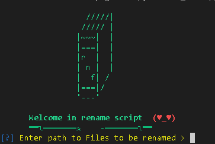

<div id="top"></div>
<!--
*** Thanks for checking out the Best-README-Template. If you have a suggestion
*** that would make this better, please fork the repo and create a pull request
*** or simply open an issue with the tag "enhancement".
*** Don't forget to give the project a star!
*** Thanks again! Now go create something AMAZING! :D
-->


<!-- PROJECT SHIELDS -->
<!--
*** I'm using markdown "reference style" links for readability.
*** Reference links are enclosed in brackets [ ] instead of parentheses ( ).
*** See the bottom of this document for the declaration of the reference variables
*** for contributors-url, forks-url, etc. This is an optional, concise syntax you may use.
*** https://www.markdownguide.org/basic-syntax/#reference-style-links
-->
[![Contributors][contributors-shield]][contributors-url]
[![Issues][issues-shield]][issues-url]
[![MIT License][license-shield]][license-url]
[![LinkedIn][linkedin-shield]][linkedin-url]


<!-- PROJECT LOGO -->
<br />
<div align="center">
  <a href="https://github.com/ealijamal/iq-rec-electron">
    
  </a>

  <h3 align="center">Rename files</h3>

  <p align="center">
    rename |files  | python!
    <br />
   
  </p>
</div>


<!-- ABOUT THE PROJECT -->
## About The Project


###  A simple application in python
Rename a group of files


<!-- GETTING STARTED -->
## Getting Started

Clone the repo
   ```sh
   https://github.com/ealijamal/golden.git
   ```
### Installation

  ```sh
  pip install huepy
   ```

### use


   ```sh
   python re_name.py
   ```

<p align="right">(<a href="#top">back to top</a>)</p>


<!-- MARKDOWN LINKS & IMAGES -->
<!-- https://www.markdownguide.org/basic-syntax/#reference-style-links -->
[contributors-shield]: https://img.shields.io/github/contributors/ealijamal/golden?style=for-the-badge
[contributors-url]: https://github.com/ealijamal/golden/graphs/contributors


[issues-shield]: https://img.shields.io/github/downloads/ealijamal/golden/total?style=for-the-badge
[issues-url]: https://github.com/ealijamal/golden/issues
[license-shield]: https://img.shields.io/github/v/release/ealijamal/golden?include_prereleases&style=for-the-badge
[license-url]: https://github.com/ealijamal/golden/blob/master/LICENSE.txt
[linkedin-shield]: https://img.shields.io/github/repo-size/ealijamal/golden?style=for-the-badge
[linkedin-url]: https://linkedin.com/in/othneildrew
[product-screenshot]: iq_rec.png

